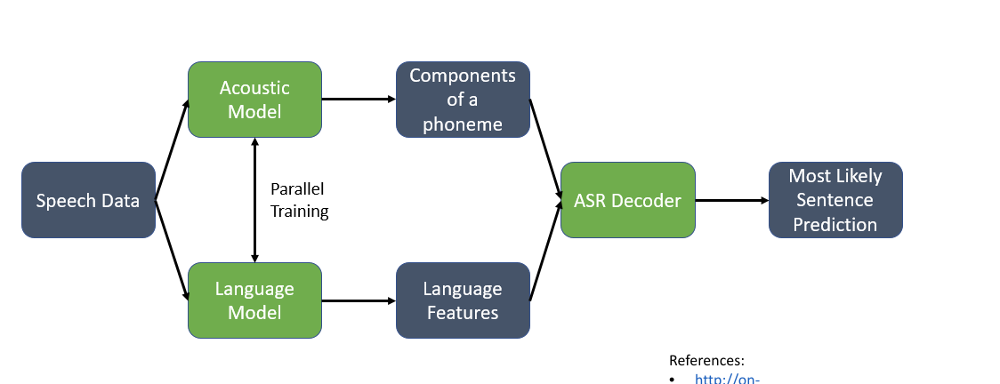
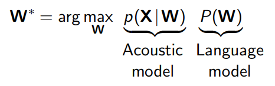
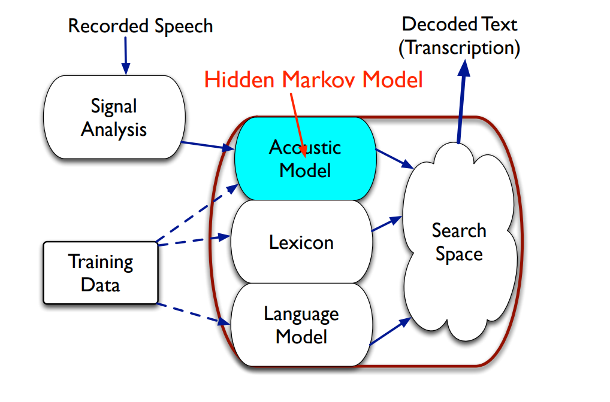
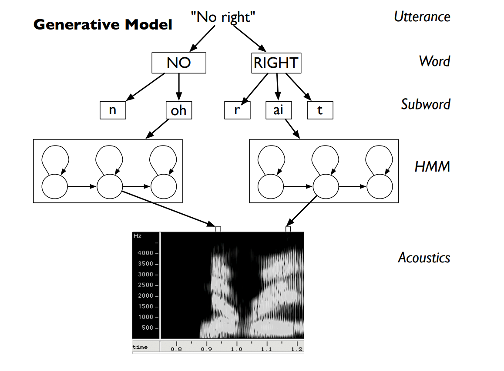
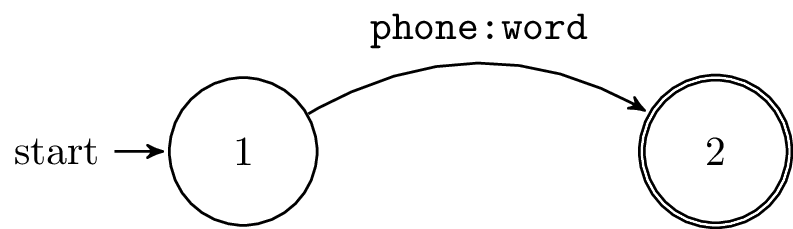

# Sunshine
*Vernacular Language trigger word detector*

## Background & Proposal

Propose Components :
1. [PyTorch](https://pytorch.org/)
2. [Kaldi](http://kaldi-asr.org/doc/index.html)
3. Misc NLP library for string matching
4. Possible extension using pretrained language models to perform further language inference


Initital Protoype and Discussion
>Basic Kaldi Architecture
> 


### Resources for Specific Questions

* [Kaldi for Dummies](
https://kaldi-asr.org/doc/kaldi_for_dummies.html#kaldi_for_dummies_environment)

* [Kaldi Lattices](https://kaldi-asr.org/doc/lattices.html)

* [Presentation](https://myelinf-my.sharepoint.com/:p:/g/personal/harsha_myelinfoundry_com/ER5nsCVZz4RMjNno_vHYLL4BXlVEqsBVWWP9Un5SrEK17g?e=4cbA8W)

### Repositories for Reference
* [Kaldi Pytorch](https://github.com/mravanelli/pytorch-kaldi#overview-of-the-toolkit-architecture)

* [Recipe for Kaldi-Arabic](http://alt.qcri.org//resources/speech/)

* [EspNet](https://github.com/espnet/espnet)

* [Kaldi-ASR](https://github.com/kaldi-asr/kaldi)

* [Nabu](https://github.com/vrenkens/nabu)

### Proposed Languages with dataset used
* [Pashto](https://catalog.ldc.upenn.edu/LDC2016S09)
* [Urdu](Some University)


#### Alternative Approaches: 
1. [Mozilla DeepSpeech](https://github.com/mozilla/DeepSpeech)
2. [Wav2Letter++](https://github.com/facebookresearch/wav2letter)

### Tasks 

- [x] Acquire Dataset
- [x] Test PyTorch Kaldi
- [x] Form Recipe
- [ ] Train PyTorch Kaldi
- [ ] Test Model on Real Time Data

# Procedure 

 ### Data Preparation:<hr><hr>
 **Refer to __Kaldi Documentation__ for any clarifications: http://kaldi-asr.org/doc/data_prep.html**

  1. Creating the data/train directory required the creating of 3 files manually:
   * __text.txt__ - Contains the transcript indexed by utterance ID's. 
   * __wav.scp__ - Contains all the full paths of all the wav audio files indexed by utterance ID's. **Make sure to edit this file before use to match your input files**
    * __utt2spk__ - Contains the utterance ID's matched to the speaker ID's.
  >Example Train folder - [data/train](s5/data/train) 
  2. Make sure all the files are in __sorted order__ for kaldi to allignment computations.
  3. Create an identical test folder with the appropriate train-test split.  
  >Example Test folder - [data/test](s5/data/test)
  4. To create the [data/local/lang](s5/data/local/lang) directory the following files are needed:
    * __lexicon.txt__: Contains the Grapheme-Phoneme relationships
    * __silence_phones.txt__: Contains the silence markers
    * __nonsilence_phones.txt__: Contains all the other graphemes.
    * __extra_questions.txt__: Just an empty file
5. Run the [run.sh](s5/run.sh) script's first section - Data & Lexicon & Language Preparation to create remaining parts of the model.

### Training the Model:<hr><hr>
 **Refer to Pytorch Kaldi-Repository documentation for any clarifications: https://github.com/mravanelli/pytorch-kaldi#overview-of-the-toolkit-architecture**

 #### Acoustic Model - Kaldi<hr>
 1. The [make_mfcc.sh](s5/steps/make_mfcc.sh) script computes the [mfcc features](#mfcc) and in implemented within the [run.sh](s5/run.sh) script. The computed features are then stored into the [s5/mfcc](s5-features/mfcc) folder. It generates the [feats.scp](s5-features/data/train/feats.scp) file.

 2. The [steps/compute_cmvn_stats.sh](s5/steps/compute_cmvn_stats.sh) script then computes the [cmvn features](#cmvn). It generated the [cmvn.scp](s5-features/data/train/cmvn.scp) file.

 3. The MFCC and CMVN features together create our acoustic model.

 #### Language Model - Kaldi<hr>
 1. Run the "Data & Lexicon & Language Preparation" section of the [run.sh](s5/run.sh) script. The following line will generate the required language model. 
 ```bash
 utils/prepare_lang.sh data/local/lang '<oov>'   data/local data/lang
 ```
 2. The language model consists of the following files:
    * __G.fst__: This contains the grammer model for the desired language in the [OpenFST format](#openfst).  
    * __L.fst__: L.fst is a [Finite State Transducer](#fst). It maps monophone sequences to words and hence allows for the allignments to be computed.
    * __L_disambig.fst__: The Phonetic Dictionary with [Disambiguation Symbols](#dis) FST. The function of this FST is to handle ambiguous phones. 
    * __oov.txt__: This file has a single line with the word (not the phone!) for out of vocabulary items  	
    * __phones__: Contains all the phones for the Phoneme representions.	
    * topo  
    * __words.txt__: It is the list of all the words in the grammer of the language model.
 3. The language model is created in the [data/lang](s5-features/data/lang) folder.
 4. The language model is a combination of multiple [FST](#fst) graphs which need to be connected in order to produce useful computation.
 5. The [utils/mkgraph.sh](s5/utils/mkgraph.sh) script is called as shown below. It combines the various graphs of the language model and creates the output in the form of the [exp/mono](s5-features/exp) folder.
 ```bash
 utils/mkgraph.sh data/lang_test exp/mono exp/mono/graph
 ```

 #### Monophone Training - Aligning the features <hr>
 1. The monophone model is trained using the [steps/train_mono.sh](s5/steps/train_mono.sh) script.
 ```bash
 steps/train_mono.sh  --nj "$train_nj" --cmd "$train_cmd" data/train data/lang exp/mono
 ```
 2. Here the $tain_cmd is a variable that generally points to the 'run.pl' file. This file enables parallel processing.
 3. Monophone model is a HMM-GMM Model
 or a [Hidden Markov](#hmm) & [Gaussian Mixture](#gmm) model.
 4. The training of the monophone models is done using unsupervised techniques from the combination of the acoustic and language models.
 <hr>

 ## Explaination of the combination of the two models <hr><hr>

  * The acoustic and language models are related by a fundamental equation based on Bayes Theorm :-
  
  > 

  * Here:
    * __X__: is the sequence of acoustic feature vectors
    * __W__: denotes a word sequence.
    * __W*__: is the most likely word sequence spoken.

* The models combine using the aforementioned equation to give us our final model. The block diagram for the conceptual model is:

> 

* We can see how the model addresses incoming data in the flowchart below

> 


# Theory and Definitions:
<a id=i-vect></a>
 * __I-Vectors__: The word i-vector stands for "identity i-vector". It allows to compute an utterance model (a vector) using the corresponding MFCC features. This is done using a technique called Factor analysis which computes 0th and 1st order statistics of a set of featres over a generic model (a mixture of Gaussians) called world model or universal background model UBM, then computes the corresponding i-vector. Roughly, the UBM descibes what the average distribution of "speech" looks like and i-vectors allow to have a representation of a speech utterance that is "relative" to that generic model. [link](https://www.researchgate.net/post/Can_someone_introduce_me_to_i_vector_approach_for_speaker_recognition)

<a id=mfcc></a>
 * __MFCC Feature__: Mel-frequency cepstral coefficients (MFCCs) are coefficients that collectively make up an MFC. They are derived from a type of cepstral representation of the audio clip (a nonlinear "spectrum-of-a-spectrum"). The difference between the cepstrum and the mel-frequency cepstrum is that in the MFC, the frequency bands are equally spaced on the mel scale, which approximates the human auditory system's response more closely than the linearly-spaced frequency bands used in the normal cepstrum. This frequency warping can allow for better representation of sound, for example, in audio compression. [link](https://en.wikipedia.org/wiki/Mel-frequency_cepstrum)

<a id=cmvn></a>
 * __CMVN Features__:Cepstral mean and variance normalization (CMVN) is a computationally efficient normalization technique for robust speech recognition. The performance of CMVN is known to degrade for short utterances. This is due to insufficient data for parameter estimation and loss of discriminable information as all utterances are forced to have zero mean and unit variance. </br>
CMVN minimizes distortion by noise contamination for robust feature extraction by linearly transforming the cepstral coefficients to have the same segmental statistics. Cepstral Normalization has been effective in the CMU Sphinx for maintaining a high level of recognition accuracy over a wide variety of acoustical environments.
[link](https://en.wikipedia.org/wiki/Cepstral_mean_and_variance_normalization)

<a if=fst></a>
 * __FST__: A finite-state transducer (FST) is a finite-state machine with two memory tapes, following the terminology for Turing machines: an input tape and an output tape. This contrasts with an ordinary finite-state automaton, which has a single tape. An FST is a type of finite-state automaton that maps between two sets of symbols. An FST is more general than a finite-state automaton (FSA). An FSA defines a formal language by defining a set of accepted strings while an FST defines relations between sets of strings.</br>
 An FST will read a set of strings on the input tape and generates a set of relations on the output tape. An FST can be thought of as a translator or relater between strings in a set. [link](https://en.wikipedia.org/wiki/Finite-state_transducer)
 </br>
 >  
    > <center><i>L.fst mapping</i></center>

<a id=openfst></a>
 * <u>__OpenFst__:</u> OpenFst is a library for constructing, combining, optimizing, and searching weighted finite-state transducers (FSTs).[link](http://www.openfst.org/twiki/bin/view/FST/WebHome)

<a id=hmm></a>
 * __Hidden Markov Model (HMM)__:Hidden Markov Model is a statistical Markov model in which the system being modeled is assumed to be a Markov process with unobservable states. The hidden Markov model can be represented as the simplest dynamic Bayesian network. [link](https://en.wikipedia.org/wiki/Hidden_Markov_model)

<a id=gmm></a>
 * __Gaussian Mixture Model(GMM)__:Gaussian mixture models are a probabilistic model for representing normally distributed subpopulations within an overall population. Mixture models in general don't require knowing which subpopulation a data point belongs to, allowing the model to learn the subpopulations automatically. Since subpopulation assignment is not known, this constitutes a form of unsupervised learning.[link](https://brilliant.org/wiki/gaussian-mixture-model/)

<a id=pho></a>
* __Phoneme__: A phoneme is one of the units of sound that distinguish one word from another in a particular language. For example, in most dialects of English, the sound patterns and are two separate words distinguished by the substitution of one phoneme, for another phoneme.[link](https://en.wikipedia.org/wiki/Phoneme)

<a id=dis></a>
 * __Disambiguation symbol__:In general, you need to have disambiguation symbols when you have one word that is a prefix of another (cat and cats in the same lexicon would need to have cat being pronounced “k ae t #1”) or a homophone of another word (red: “r eh d #1”, read: “r eh d #2”). If you don’t have these then the models become nondeterministic.</br><u>Symbols like #1 and #2 that go on the ends of words to ensure determinizability.</u>